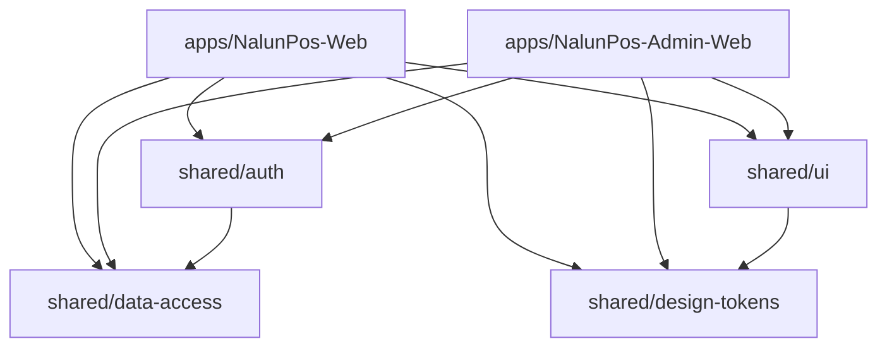

# Arquitectura Frontend — NalunPos Enterprise (Angular 22 Monorepo)

## 1. Propósito y Estructura Global

El ecosistema frontend de **NalunPos** está construido sobre un **Monorepo Nx** con **Angular 22** Zoneless, diseñado para máxima escalabilidad, rendimiento extremo y mantenibilidad a largo plazo (20+ años).

### 1.1 Aplicaciones (`apps/`)

- **`NalunPos-Admin-Web`**: Consola administrativa global para la gestión de la plataforma multi-tenant (SuperAdmin), monitoreo de sharding de bases de datos, métricas y administración de tenants.
- **`NalunPos-Web`**: Consola operativa de negocio (Admin Comercial / Tenant / Cajero), enfocada en el punto de venta (POS), ventas, inventario, almacenes, proveedores y clientes.

### 1.2 Librerías Compartidas (`libs/shared/`)

- **`libs/shared/auth`**: `AuthService`, interceptores de autorización y control de sesión (`authTokenInterceptor`, `sessionExpiredInterceptor`), guards funcionales (`authGuard`, `roleGuard`), interfaces tipadas y modelo de sesión de usuario `UserSession`.
- **`libs/shared/data-access`**: Configuración dinámica de runtime (`APP_CONFIG`, `AppConfigService`), interceptores globales (`correlationIdInterceptor`, `errorInterceptor`) y modelos de error estandarizados (`ProblemDetails`, `AppError`).
- **`libs/shared/ui`**: Componentes visuales puros reutilizables (`AppShellComponent`, `HeaderComponent`, `SidebarComponent`, `BaseLoginComponent`, `PageHeroCardComponent`, `MetricsBentoGridComponent`, `QuickFilterBarComponent`, `AdvancedFilterDrawerComponent`, `NotificationService`).
- **`libs/shared/design-tokens`**: Fuente única de verdad visual M3 (`theme.css`), tokens de diseño semánticos y tipografías auto-alojadas (`@fontsource`).

---

## 2. Regla de Dependencias y Module Boundaries (Clean Architecture)

El monorepo hace cumplir fronteras arquitectónicas automáticas mediante `@nx/enforce-module-boundaries` en ESLint:


```mermaid
graph TD
    Web[apps/NalunPos-Web] --> Auth[shared/auth]
    Web --> DataAccess[shared/data-access]
    Web --> UI[shared/ui]
    Web --> Tokens[shared/design-tokens]

    Admin[apps/NalunPos-Admin-Web] --> Auth
    Admin --> DataAccess
    Admin --> UI
    Admin --> Tokens

    UI --> Tokens
    Auth --> DataAccess
```

1. **`apps/*`** consumen `libs/shared/*` según su scope (`scope:web`, `scope:admin-web`).
2. **`libs/shared/*`** **NUNCA** importan código de `apps/*`.
3. **`libs/shared/ui`** es de presentación pura; consume tokens de diseño y no realiza peticiones HTTP directas ni gestiona lógica de negocio.
4. **Cero Dependencias Circulares**: Cada capa tiene un flujo unidireccional estricto.

### 2.1 Cadena de Interceptores HTTP Funcionales y Orden Estricto

Ambas aplicaciones (`apps/NalunPos-Web/src/app/app.config.ts` y `apps/NalunPos-Admin-Web/src/app/app.config.ts`) configuran una cadena idéntica y estricta de interceptores HTTP funcionales mediante `provideHttpClient(withFetch(), withInterceptors([...]))`:

1. **`correlationIdInterceptor`** (1° — `libs/shared/data-access`):
   - Genera y adjunta la cabecera `X-Correlation-Id` con un UUIDv4 único a cada petición saliente para telemetría y rastreo distribuido.
2. **`authTokenInterceptor`** (2° — `libs/shared/auth`):
   - Inyecta la cabecera `Authorization: Bearer <token>` obtenida desde `AuthService`.
   - **Validación de Origen Estricto (ADR 0014):** Comprueba que el origen de la URL destino coincida de manera exacta con el origen canónico autorizado (`apiUrl`), mitigando colisiones de orígenes y URLs malformadas para prevenir fugas de tokens.
3. **`sessionExpiredInterceptor`** (3° — `libs/shared/auth`):
   - Captura respuestas HTTP 401 (Unauthorized) y 403 (Forbidden). En caso de 401, limpia la sesión activa y redirige a `/login`. En caso de 403, redirige a `/forbidden`.
4. **`errorInterceptor`** (4° — `libs/shared/data-access`):
   - Captura cualquier `HttpErrorResponse` remanente y lo transforma en el modelo estandarizado de dominio `AppError` (`ProblemDetails` RFC 7807).

**¿Por qué es crítico este orden?**

- `correlationIdInterceptor` debe ser el primero para que cualquier error originado en los interceptores subsecuentes conserve su identificador de correlación.
- `authTokenInterceptor` debe preceder a los manejadores de respuesta para garantizar que solo se envíen credenciales a destinos autorizados.
- `sessionExpiredInterceptor` debe ejecutarse antes de `errorInterceptor` para que las expiraciones de sesión (401/403) desencadenen la redirección y limpieza inmediata antes de ser tratadas como errores genéricos de red.

---

## 3. Patrón Feature Slice: Contenedores Inteligentes vs. Presentación Dumb

Cada módulo funcional (ej. `warehouses`, `categories`, `suppliers`) sigue una estructura modular estándar (ADR 0011):

```
features/<feature-name>/
├── components/          # Dumb components (presentación pura, inputs/outputs puros)
├── data-access/         # Servicios HTTP reactivos y adaptadores de datos
├── models/              # Interfaces, DTOs y tipos inmutables
├── pages/               # Smart/Container components (orquestación, señales, diálogos)
└── <feature>.routes.ts  # Rutas con lazy loading standalone
```

- **Smart / Container (`pages/`)**: Inyectan servicios, orquestan el estado reactivo con Signals (`signal`, `computed`), gestionan diálogos modales y emiten notificaciones.
- **Dumb / Presentation (`components/`)**: Reciben datos vía `input()` de Angular, emiten acciones del usuario vía `output()`, y mantienen `ChangeDetectionStrategy.OnPush` estricto sin inyectar servicios HTTP.

---

## 4. Diseño Visual: Material M3 + Tailwind CSS v4

Para erradicar conflictos de especificidad CSS y preservar una identidad visual empresarial:

1. **Angular Material M3**: Resuelve componentes complejos y accesibles (tablas con ordenamiento/paginación, diálogos, selectores, tooltips, snackbars).
2. **Tailwind CSS v4**: Resuelve layouts (`flex`/`grid`), micro-animaciones, efectos Glassmorphism y espaciados responsivos.
3. **Cero `!important`**: Queda estrictamente vetado el uso de `!important` en archivos de estilos. Toda personalización se deriva de tokens semánticos en `libs/shared/design-tokens/src/theme.css`.
4. **Tipografías Auto-Alojadas (Zero External Requests)**: Fuentes corporativas (`@fontsource/plus-jakarta-sans`, `@fontsource/inter`, `@fontsource/jetbrains-mono`, `@fontsource-variable/material-symbols-outlined`) alojadas localmente sin dependencias externas hacia CDN de Google Fonts.

---

## 5. Configuración en Runtime (12-Factor App)

Las aplicaciones no contienen URLs de backend hardcodeadas (ADR 0009 y ADR 0014):

- **Modelo en Producción**: El build de producción **NO** empaqueta ningún archivo `config.json` en `dist/` ni en `public/`. Los artefactos compilados son completamente inmutables.
- **Suministro Externo en Despliegue**: El entorno de hosting (Cloudflare Pages, Nginx, CDN o contenedor) provee `/config.json` copiando y adaptando la plantilla `apps/<app>/config/config.example.json` junto a los artefactos estáticos (ADR 0014).
- **Inyección y Validación Fuerte**: En el arranque (`main.ts`), `provideAppInitializer()` solicita `/config.json`, validándolo estrictamente mediante `validateAppConfig` e inyectándolo a través del token fuertemente tipado `APP_CONFIG`.
- **Desarrollo Local vs Producción**:
  - En desarrollo, si `/config.json` no está presente, se utiliza un fallback transparente derivado de `environment.ts` (`https://localhost:7232`).
  - En producción, opera bajo un principio **fail-closed**: si `/config.json` no existe (HTTP 404) o sus campos son inválidos, la aplicación detiene su inicialización e impide realizar peticiones a endpoints no autorizados.
- **Principio "Build Once, Deploy Anywhere"**: El mismo artefacto compilado se despliega en cualquier infraestructura modificando exclusivamente el archivo `/config.json` externo.

---

## 6. Estrategia de Calidad y Pruebas Automatizadas

1. **Pruebas Unitarias Rápidas con Vitest**:
   - Ejecutadas en entorno `jsdom` con inicialización JIT nativa de Angular 22 (`@angular/compiler` + `@angular/platform-browser/testing`).
   - Cobertura de código monitoreada con `@vitest/coverage-v8`: 165 tests unitarios en 28 suites pasando al 100%, con cobertura global de 43.95% de líneas en el monorepo y superior al 95% en librerías críticas de lógica de negocio (`libs/shared/auth` y `libs/shared/data-access`).
2. **Verificación Automatizada de Seguridad de Artefactos y CSP (`verify:csp`)**:
   - Herramienta nativa [`tools/verify-csp.mjs`](../../tools/verify-csp.mjs) ejecutada en CI tras el build de producción para validar la integridad de directivas CSP, hashes SHA-256 de scripts inline, ausencia total de `config.json` y de `localhost` en artefactos compilados.
3. **Pruebas E2E Smoke con Playwright**:
   - Pruebas end-to-end automatizadas en Chromium headless con interceptación de red vía `page.route()`, incluyendo intercepción de `/config.json` y monitoreo de eventos DOM `securitypolicyviolation`.

---

## 7. Directrices de Seguridad Frontend

- **Ausencia total de vulnerabilidades XSS**: 0 usos de `innerHTML` crudo y 0 usos de `bypassSecurityTrust*`.
- **Content Security Policy (CSP) Estricta (ADR 0014)**: Origen canónico fijo (`https://api.nalunpos.com`) en `connect-src`, hashes SHA-256 en `script-src` y prohibición absoluta de `unsafe-inline` y comodines `*`.
- **Deduplicación Canónica de Datos y Tokens UI (ADR 0013)**: Centralización DRY de servicios de datos en `libs/shared/data-access` y abstracción `AUTH_GATEWAY` en `libs/shared/ui`.
- **Evolución hacia Autenticación Zero-Trust (ADR 0012)**: Almacenamiento en memoria volátil de access tokens de corta duración combinado con refresh tokens en cookies seguras `HttpOnly` y `SameSite=Strict`.

---

## 8. Registro de Decisiones de Arquitectura (ADRs) y Registros Históricos

- **Índice Maestro de ADRs**: El registro maestro de decisiones se encuentra en [`docs/architecture/adr/README.md`](./adr/README.md), abarcando desde **ADR 0001** hasta **ADR 0014**.
- **Registros Históricos de Refactorización**:
  - [Refactor F0-4: Eliminación de Duplicación entre Apps y Extracción a Shared-UI](./history/refactor-f0-4-duplication-elimination.md).
